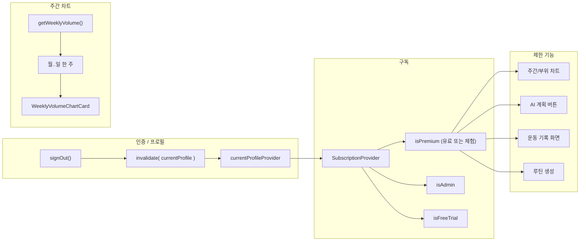

# Admin 시스템 정비, 무료 체험, 주간 차트 수정

## 개요

관리자 버튼 노출 및 로그아웃 시 상태 초기화를 보강하고, 프리미엄 해제(Revoke Premium) 기능을 추가하며, 7일 무료 체험 로직을 SubscriptionProvider에 반영하고, 주간 볼륨 차트를 캘린더 주(월요일~일요일) 기준으로 수정합니다.

---

## 서브태스크 1: 관리자 버튼 노출 및 로그아웃 시 상태 (보안)

**현재 상태**
- [subscription_provider.dart](lib/presentation/providers/subscription_provider.dart): `isAdmin`은 이미 `profile?.isAdmin == true`에서만 파생됨(37번째 줄). 하드코딩된 `true`나 강제 관리자 로직 없음.
- [my_page_screen.dart](lib/presentation/screens/profile/my_page_screen.dart): Admin 메뉴는 이미 `if (subscription.isAdmin)`으로 감싸져 있음(125번째 줄).

**보완 필요 사항**
- `currentProfileProvider`는 인증 상태에 의존하지 않는 `FutureProvider`임. `signOut()` 후에도 프로바이더가 이전 프로필을 유지하므로, 사용자 A 로그아웃 후 사용자 B로 로그인해도 UI가 사용자 A의 프로필(및 `isAdmin`)을 보여줄 수 있음.

**수정 사항**
1. [my_page_screen.dart](lib/presentation/screens/profile/my_page_screen.dart)에서:
   - `_signOut()`: `await ref.read(authRepositoryProvider).signOut()` 이후에 `ref.invalidate(currentProfileProvider)` 호출하여, 다음 읽기에서 프로필을 다시 가져오도록 함(로그아웃 시 null).
   - `_confirmAndDeleteAccount()`: 최종 `signOut()` 호출 이후에도 동일하게 `ref.invalidate(currentProfileProvider)` 추가.
2. `SubscriptionProvider`의 `isAdmin` 출처는 변경하지 않음. 로그아웃 시에만 프로필 무효화 처리.

---

## 서브태스크 2: 프리미엄 해제(Revoke Premium)

**레포지토리**
- 파일: [user_repository.dart](lib/data/repositories/user_repository.dart)
- 추가: `Future<void> revokePremium(String targetUserId)` 메서드. Supabase RPC `admin_revoke_premium` 호출, 파라미터 `target_id` 전달. 예외 시 명확한 메시지로 재throw(예: "프리미엄 해제 실패: $e").

**UI**
- 파일: [admin_screen.dart](lib/presentation/screens/admin/admin_screen.dart)
- **"프리미엄 해제"** 버튼 추가(빨간색/경고 스타일, 예: `styleFrom(backgroundColor: Colors.red)` 또는 OutlinedButton).
- 탭 시: `_targetIdController.text` 읽어서 `ref.read(userRepositoryProvider).revokePremium(targetId)` 호출, 성공 시 SnackBar "프리미엄 해제됨", 실패 시 에러 SnackBar 표시.
- `targetId == Supabase.instance.client.auth.currentUser?.id`인 경우(본인 대상), 성공 후 `ref.invalidate(currentProfileProvider)` 호출하여 구독 UI가 즉시 갱신되도록 함.

**전제**
- Supabase RPC `admin_revoke_premium(target_id)`가 존재하며, 해당 사용자의 프리미엄을 해제함(예: `is_premium` false 또는 `premium_until` 과거로 설정). 없으면 백엔드에서 별도 추가 필요.

---

## 서브태스크 3: 7일 무료 체험 및 기능 제한(Feature Gating)

**모델**
- [user_profile.dart](lib/data/models/user_profile.dart)에 이미 `createdAt`(`created_at`) 필드 있음. 변경 없음.

**SubscriptionProvider**
- 파일: [subscription_provider.dart](lib/presentation/providers/subscription_provider.dart)
- `SubscriptionState`에 `bool isFreeTrial` 필드 추가.
- 프로바이더의 `data` 분기에서:
  - 개발용 우회 유지: `if (!kReleaseMode && forcePremiumDevMode) return SubscriptionState(..., isFreeTrial: false);`
  - `hasPaid = profile?.isPremium == true && (profile?.premiumUntil == null || profile!.premiumUntil!.toUtc().isAfter(DateTime.now().toUtc()));` 계산.
  - `isFreeTrial`: `profile?.createdAt != null`이면 `trialEnd = profile!.createdAt!.add(const Duration(days: 7))`, 그다음 `isFreeTrial = DateTime.now().isBefore(trialEnd)`; 아니면 `false`.
  - `isPremium = hasPaid || isFreeTrial`.
  - `SubscriptionState(isPremium: ..., isAdmin: ..., isFreeTrial: ..., isLoading: false)` 반환.

**기능 제한 적용**
- [workout_log_screen.dart](lib/presentation/screens/workout/workout_log_screen.dart): 주간 볼륨 차트·부위 밸런스 차트는 이미 `_PremiumGate`로 감싸져 있음. 아래에 프리미엄 체크 추가:
  - **AI 강도 측정 / 계획 수립** 버튼: `!isPremium`일 때 비활성화하고 툴팁/스낵바 표시 또는 "프리미엄 필요" 문구로 감싸기(차트와 동일 패턴).
  - **지난 운동 기록 보러가기**: `!isPremium`이면 비활성화하거나, 이동 대상 화면에서 제한 처리.
- [workout_history_screen.dart](lib/presentation/screens/workout/workout_history_screen.dart): 빌드 시 `ref.watch(subscriptionProvider).isPremium`이 false이면 기록 목록 대신 전체 화면 메시지(예: "프리미엄 기능입니다" + 업그레이드 버튼) 표시; true이면 기존 내용 표시.
- [management_screen.dart](lib/presentation/screens/management/management_screen.dart) (루틴 탭): `subscriptionProvider` watch. **"루틴 생성하기"** 버튼은 `!isPremium`이면 비활성화하고 스낵바 또는 툴팁 "프리미엄 필요" 표시, 아니면 `_showCreateRoutineModal(context)` 호출.

---

## 서브태스크 4: 주간 볼륨 차트 — 캘린더 주(월~일)

**데이터**
- 파일: [workout_repository.dart](lib/data/repositories/workout_repository.dart), 메서드 `getWeeklyVolume()`(약 704~751번째 줄).
- "롤링 7일"(오늘 기준 6일 전 ~ 오늘) 대신 **현재 캘린더 주** 사용:
  - `DateTime now = DateTime.now();`
  - `DateTime startOfWeek = DateTime(now.year, now.month, now.day).subtract(Duration(days: now.weekday - 1));` (Dart `weekday`: 월=1, 일=7)
  - `DateTime endOfWeek = startOfWeek.add(const Duration(days: 6));`
  - `startOfWeek`(00:00:00) ~ `endOfWeek`(23:59:59) 포함 구간으로 조회(예: exclusive end를 쓰려면 `endLocal = endOfWeek.add(const Duration(days: 1))` 또는 해당일 끝 시각 사용).
- `result`를 해당 주의 월~일 7일 키로 채움(막대가 항상 월~일; 아직 안 지난 요일은 0으로 표시).

**UI**
- 파일: [workout_log_screen.dart](lib/presentation/screens/workout/workout_log_screen.dart), 클래스 `WeeklyVolumeChartCard`.
- 현재는 `days`를 `today - (6-i)`(롤링 7일)로 구성. **현재 주 월~일**로 변경:
  - `startOfWeek = DateTime(now.year, now.month, now.day).subtract(Duration(now.weekday - 1));`
  - `days = List.generate(7, (i) => startOfWeek.add(Duration(days: i)));`
- X축 라벨은 월 → 일 유지; 각 7일에 대해 `weeklyVolume[d] ?? 0.0` 사용(레포지토리와 UI가 동일한 주 정의 사용).

---

## 구현 순서

1. **로그아웃 시 프로필 무효화** (MyPageScreen) — 빠르게 적용, 이전 관리자/프리미엄 상태 방지.
2. **프리미엄 해제** — UserRepository + AdminScreen.
3. **SubscriptionProvider** — `isFreeTrial` 추가 및 7일 체험 반영한 `isPremium` 계산.
4. **기능 제한** — WorkoutLogScreen(AI·기록 버튼), WorkoutHistoryScreen(프리미엄 게이트), ManagementScreen(루틴 생성).
5. **주간 차트** — WorkoutRepository `getWeeklyVolume()` 수정 후 `WeeklyVolumeChartCard`의 요일/X축 수정.

---

## 다이어그램

